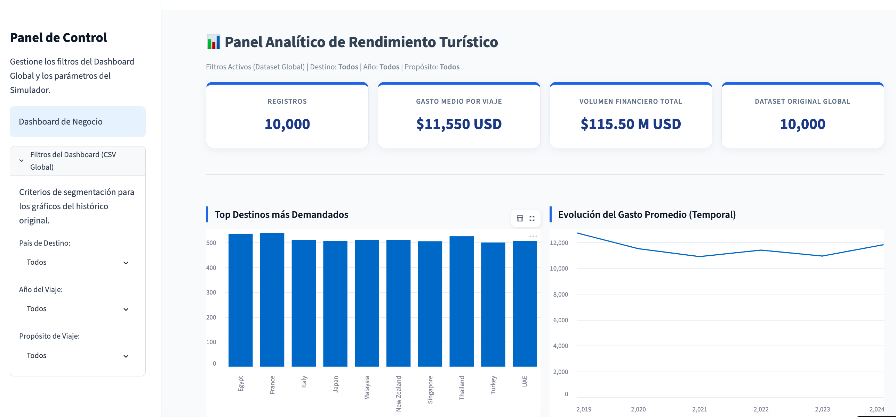

# Tourism Spending Forecasting

End-to-end Machine Learning project focused on forecasting tourism expenditure through regression modeling, business analytics, and interactive deployment with Streamlit.

<p align="left">
  
  
  
  
  
  
  
  
</p>

---

## Live Demo

🔗 **Streamlit Application:** [View Live Demo](https://your-streamlit-app.streamlit.app)

---

## Application Preview



---

## Project Overview

This collaborative project was developed by a team of four Data Analysts to explore international tourism patterns and build a predictive model capable of estimating total trip expenditure based on traveler, destination, and trip characteristics.

The project covers the complete machine learning workflow:

- Data cleaning and preprocessing
- Exploratory Data Analysis (EDA)
- Feature engineering
- Regression modeling
- Hyperparameter optimization
- Model evaluation
- Business insights generation
- Streamlit deployment

---

## Collaborative Project

This project was developed collaboratively by a team of four members across all project stages.

### Team Contributions

- Data cleaning and preparation
- Exploratory data analysis
- Data visualization
- Machine learning modeling
- Model evaluation
- Documentation and presentation

---

## Dataset

### Original Dataset

**File:** `global_tourism_travel_trends.csv`

Contains information from approximately **10,000 international trips**, including traveler profiles, destinations, budgets, travel behavior, satisfaction metrics, and expenditure data.

### Processed Dataset

**File:** `dataset_viajes_procesado.csv`

Prepared dataset for machine learning after:

- Data cleaning
- Missing value treatment
- Categorical encoding
- Feature selection
- Dataset optimization

| Metric | Value |
|----------|---------|
| Records | 10,000 |
| Features | 23 |
| Problem Type | Regression |

---

## Machine Learning Pipeline

```text
Raw Data
    ↓
Data Cleaning
    ↓
Train / Test Split
    ↓
Model Training
    ↓
Evaluation
    ↓
Optimization
    ↓
Final Model
```

---

## Evaluation Metrics

The following regression metrics were used:

| Metric | Description |
|----------|-------------|
| MAE | Mean Absolute Error |
| MSE | Mean Squared Error |
| RMSE | Root Mean Squared Error |
| R² | Coefficient of Determination |

---

## Key Insights

The analysis revealed several important drivers of tourism expenditure:

- Initial travel budget is one of the strongest predictors.
- Trip duration has a direct impact on total spending.
- Daily restaurant expenses strongly correlate with final expenditure.
- Spending behavior varies significantly across traveler profiles.
- Destination choice substantially influences overall trip costs.

---

## Project Structure

```text
Tourism_spending_forecasting
│
├── assets/
│   └── dashboard_preview.png
│
├── app.py
├── DA_Project_Regression_Grupo_4_final.ipynb
├── dataset_viajes_procesado.csv
├── global_tourism_travel_trends.csv
├── modelo_turismo.pkl
├── modelo_metadata.json
├── requirements.txt
└── README.md
```

---

## Results

The project demonstrates that tourism expenditure can be predicted with a meaningful level of accuracy using information available before a trip takes place.

The resulting model can support decision-making for:

- Travel agencies
- Tourism companies
- Marketing teams
- Booking platforms
- Tourism promotion organizations

---

## Business Value

This solution transforms tourism data into actionable insights and predictive capabilities that can support planning, segmentation, pricing strategies, and customer understanding within the tourism industry.

---

## Conclusion

This project combines Data Analytics, Machine Learning, and deployment into a complete predictive solution.

Beyond model performance, its primary value lies in transforming tourism data into actionable insights that help understand traveler behavior and support business decision-making.
